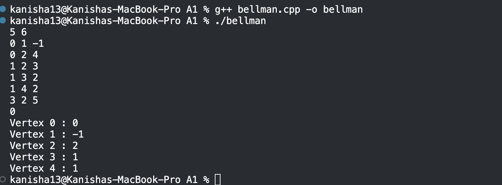

# Bellman-Ford Algorithm — Code Analysis Notes


## 1. Complexity Analysis

| Type | Value | Reason |
|------|-------|--------|
| Time | O(V × E) | V-1 outer passes, each scanning all E edges |
| Space | O(V + E) | `dist` array of size V, edge list of size E |

- The double loop `(V-1) × E` is the core cost — unavoidable for Bellman-Ford.
- The negative cycle check is a single extra pass over E edges → O(E), negligible.

---

## 2. Line-by-Line Breakdown

### Input Reading
```cpp
vector<tuple<int,int,int>> edges(E);
for (auto& [u, v, w] : edges)
    cin >> u >> v >> w;
```
- Stores all edges as `(from, to, weight)` tuples in a flat list.
- Uses **structured bindings** (`auto& [u, v, w]`) - C++17 feature that unpacks the tuple cleanly.
- A flat edge list is the right choice here because Bellman-Ford needs to scan *all* edges every pass - an adjacency list gives no benefit.

### Distance Initialization
```cpp
vector<long long> dist(V, LLONG_MAX / 2);
dist[src] = 0;
```
- `LLONG_MAX / 2` is used instead of `LLONG_MAX` to avoid overflow.
- If you use `LLONG_MAX` and do `dist[u] + w`, the addition wraps around to a negative number - an unreachable vertex would incorrectly appear reachable.
- Dividing by 2 gives a safe "infinity" that survives addition.

### Core Relaxation Loop
```cpp
for (int i = 0; i < V - 1; i++)
    for (auto& [u, v, w] : edges)
        if (dist[u] + w < dist[v])
            dist[v] = dist[u] + w;
```
- **Why V-1 passes?** A shortest path in a graph with V vertices can have at most V-1 edges (no repeated vertices). One pass guarantees at least one edge is finalized. So V-1 passes finalize all edges.
- **Relaxation:** If the known distance to `u` plus the edge weight `w` is better than the known distance to `v`, we update `dist[v]`. This is the core Bellman-Ford operation.

### Negative Cycle Detection
```cpp
bool negative_cycle = false;
for (auto& [u, v, w] : edges)
    if (dist[u] + w < dist[v])
        negative_cycle = true;
```
- After V-1 passes, all shortest paths (if they exist) are finalized.
- If we can *still* relax any edge, it means a path is getting shorter infinitely — which only happens if a negative cycle is reachable from the source.
- This is the V-th pass and costs only O(E).

### Output
```cpp
cout << "Vertex " << i << " : "
     << (dist[i] >= LLONG_MAX / 2 ? -1 : dist[i]) << "\n";
```
- Vertices where `dist[i]` is still `LLONG_MAX / 2` were never reached — printed as `-1` to signal unreachability.

---


## 3. Corner Cases Handled

| Case | How it's handled |
|------|-----------------|
| Unreachable vertex | `dist` stays `LLONG_MAX / 2`, printed as `-1` |
| Negative weight edges | Bellman-Ford handles natively |
| Negative weight cycle | Detected on the V-th relaxation pass |
| Overflow on dist + weight | `LLONG_MAX / 2` prevents integer overflow |
| Single vertex (V=1) | Loop runs 0 times, dist[0] = 0, correct |

---

## 5. Sample Dry Run

**Input:**
```
5 6
0 1 -1
0 2 4
1 2 3
1 3 2
1 4 2
3 2 5
Source: 0
```



---

