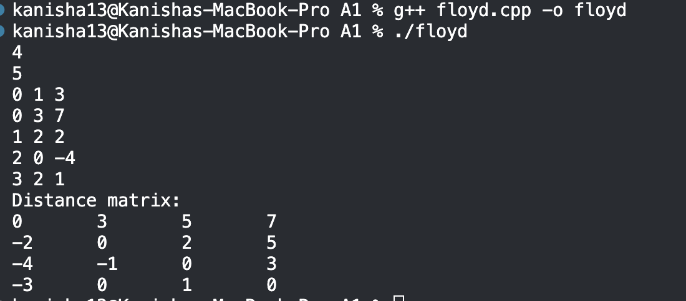

# Floyd-Warshall Algorithm
---

## Sample Input

```
4
5
0 1 3
0 3 7
1 2 2
2 0 -4
3 2 1
```


---

## Analysis

### What does Floyd-Warshall do?

It finds the shortest path between **every pair of vertices** in one go.
Bellman-Ford only finds shortest paths *from one source*. Floyd-Warshall
finds them *from every vertex to every other vertex* — that's why the
output is a full matrix, not just one row.

### Time & Space Complexity

| Type | Value | Reason |
|------|-------|--------|
| Time | O(V³) | Three nested loops, each running V times |
| Space | O(V²) | The distance matrix is V × V |

### How the Core Loop Works

```cpp
dist[i][j] = min(dist[i][j], dist[i][mid] + dist[mid][j]);
```

Think of it like asking: *"Is it cheaper to go from i to j directly,
or to stop at `mid` along the way?"*

We try every single vertex as a possible stopover (`mid`), for every
possible pair (i, j). After all three loops finish, `dist[i][j]` holds
the absolute shortest path between i and j.

### Why it Works with Negative Edge Weights

Floyd-Warshall does not make any greedy assumptions — it does not say
"this vertex is done, never touch it again" like Dijkstra does. Instead,
it just keeps comparing options and picks the minimum. So even if an
edge has a negative weight, the comparison `dist[i][mid] + dist[mid][j]`
still works correctly — a smaller (more negative) result just wins the
`min()` check.

### Why it Fails with Negative Cycles

A negative cycle is a loop where the total weight is negative — for
example, going A → B → C → A costs -5 total. If you keep going around
that loop, your "distance" keeps shrinking forever (-5, -10, -15...).
Floyd-Warshall cannot produce a meaningful answer because there is no
shortest path — it just goes to negative infinity. We detect this by
checking if `dist[i][i] < 0` after the algorithm finishes. A vertex
should always have a distance of 0 to itself. If it's negative, it
means the vertex is part of (or reachable through) a negative cycle.


### Corner Cases

| Case | How it's handled |
|------|-----------------|
| No path between i and j | `dist[i][j]` stays `INF` |
| Negative edge weights | Handled natively by `min()` |
| Negative cycle | `dist[i][i] < 0` check catches it |
| Overflow on INF + weight | `if` guard skips rows/cols that are still INF |